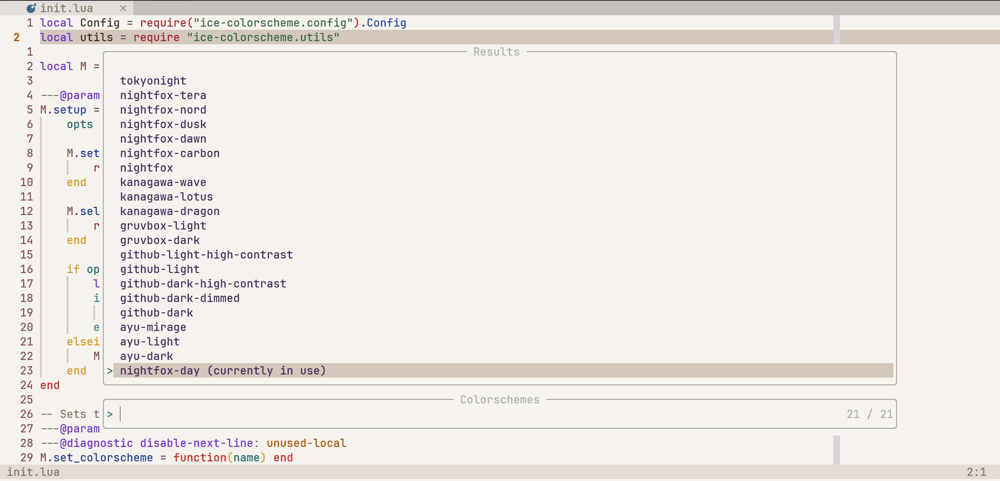

# Ice-Colorscheme

A colorscheme selector for neovim. Originally part of [IceNvim](https://github.com/Shaobin-Jiang/IceNvim).



## Installation

The recommended way is to use [lazy.nvim](https://lazy.folke.io/):

```lua
{
    "Shaobin-Jiang/ice-colorscheme",
    dependencies = { "nvim-telescope/telescope.nvim" },
    opts = {},
}
```

## Configuration

Ice-Colorscheme comes with the following defaults:

```lua
{
    -- A table of pre-configured colorschemes
    -- The keys will be displayed in the selector and the values will be used to set up the colorscheme
    -- The colorscheme must be installed first!
    -- See below for more detail
    colorschemes = {},
    -- If set to a function, it will be executed whenever a colorscheme is set
    setup = nil,
    -- Default colorscheme to use if no cache is found
    colorscheme = nil,
    -- Whether the change in colorscheme should persist to the next neovim session
    -- If true, the colorscheme will be written to a cache file
    lasting_change = true,
    -- The cache file referred to above
    colorscheme_cache = vim.fn.stdpath "data" .. "/colorscheme",
    -- The string appended after the current colorscheme in the selector
    suffix_current = " (Current)",
    -- The prompt title of the selector
    prompt_title = "Colorschemes",
}
```

The `colorschemes` field should look like this:

```lua
{
    ["ayu-light"] = {
        name = "ayu",
        setup = function()
            vim.g.ayucolor = "light"
        end,
        dark = false,
    },
    tokyonight = {
        name = "tokyonight",
        setup = {
            style = "moon",
            styles = {
                comments = { italic = true },
                keywords = { italic = false },
            },
        },
        dark = true,
    },
}
```

The names like `ayu-light` and `tokyonight` will appear in the colorscheme selector. Only names that are included in the `colorschemes` field can be used in `set_colorscheme`. As for the individual tables corresponding to each colorscheme, it should at least include a `name` property, which is the name of the colorscheme plugin. To be more precise, it is the name you would use in a `require` call.

The `setup` and `dark` properties are optional. `setup` can either be a function that gets executed when the colorscheme is selected or a table to be passed to the `setup` function of the colorscheme plugin. `dark` is a boolean value indicating whether `vim.o.background` should be set to `"dark"`.

## Using the Selector

You can easily start the colorscheme selector with this piece of lua code:

```lua
require("ice-colorscheme").select_colorscheme()
```

This will bring up a telescope window from which you can pick one colorscheme.

## Setting the Colorscheme

If you want to change the colorscheme without calling out the selector but wishes the change you make to persist to the next neovim session, you can do something like this:

```lua
require("ice-colorscheme").set_colorscheme("tokyonight")
```
